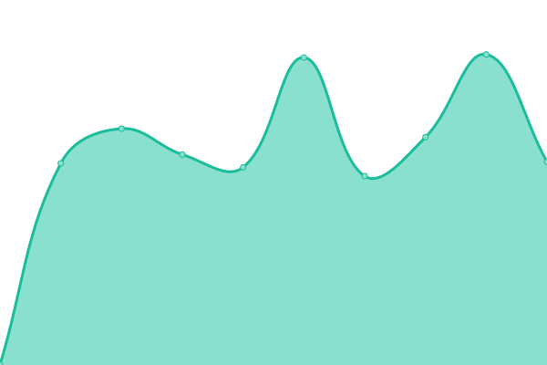
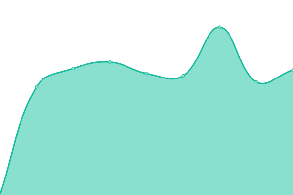

# [📈 Statut en direct](https://status.freshfishcameroun.com): <!-- Statut en direct --> **🟩 All systems operational**

This repository contains the open-source uptime monitor and status page for [Steeven-Duncan-First](https://status.freshfishcameroun.com), powered by [Upptime](https://github.com/upptime/upptime).

With [Upptime](https://upptime.js.org), you can get your own unlimited and free uptime monitor and status page, powered entirely by a GitHub repository. We use [Issues](https://github.com/Steeven-Duncan-First/upptime/issues) as incident reports, [Actions](https://github.com/Steeven-Duncan-First/upptime/actions) as uptime monitors, and [Pages](https://status.freshfishcameroun.com) for the status page.

## [📈 Live Status](https://demo.upptime.js.org): <!--live status--> **🟩 All systems operational**

<!--start: status pages-->
<!-- This summary is generated by Upptime (https://github.com/upptime/upptime) -->
<!-- Do not edit this manually, your changes will be overwritten -->
<!-- prettier-ignore -->
| URL | Status | History | Response Time | Uptime |
| --- | ------ | ------- | ------------- | ------ |
|  [Odoo Fresh Fish Production](https://odoo.freshfishcameroun.com) | Opérationnel | [odoo-fresh-fish-production.yml](https://github.com/Steeven-Duncan-First/upptime/commits/HEAD/history/odoo-fresh-fish-production.yml) | 

 777ms
     
 | 

<a href="https://Steeven-Duncan-First.github.io/upptime/history/odoo-fresh-fish-production">100.00%</a>
    

|  [Odoo Fresh Fish API](https://odoo.freshfishcameroun.com/web/database/selector) | Opérationnel | [odoo-fresh-fish-api.yml](https://github.com/Steeven-Duncan-First/upptime/commits/HEAD/history/odoo-fresh-fish-api.yml) | 

 475ms
     
 | 

<a href="https://Steeven-Duncan-First.github.io/upptime/history/odoo-fresh-fish-api">100.00%</a>
    

<!--end: status pages-->

[**Visit our status website →**](https://steeven-duncan-first.github.io/upptime))

## 📄 License

- Powered by: [Upptime](https://github.com/upptime/upptime)
- Code: [MIT](./LICENSE) © [Anand Chowdhary](https://anandchowdhary.com), supported by [Pabio](https://pabio.com)
- Data in the `./history` directory: [Open Database License](https://opendatacommons.org/licenses/odbl/1-0/)
